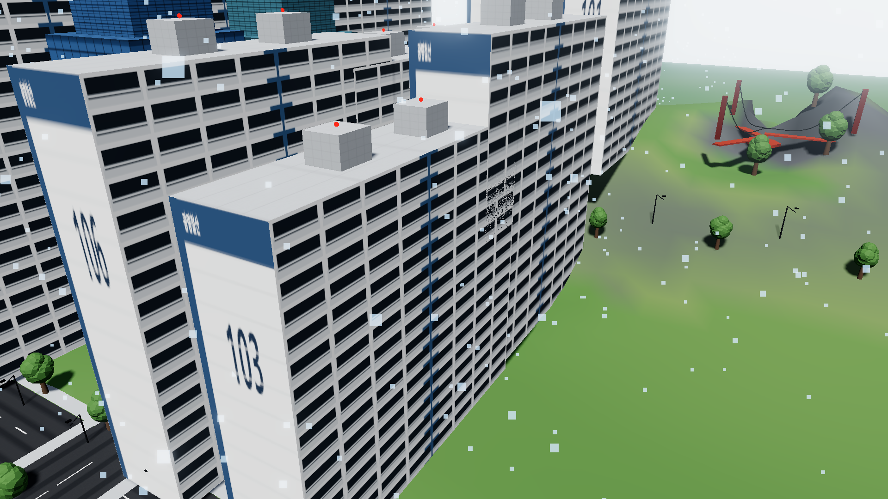
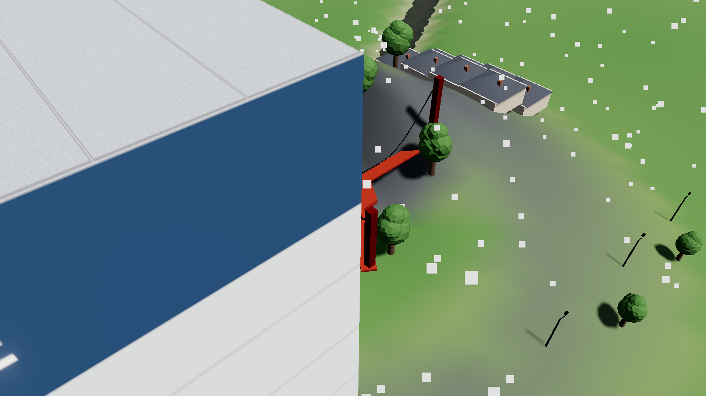
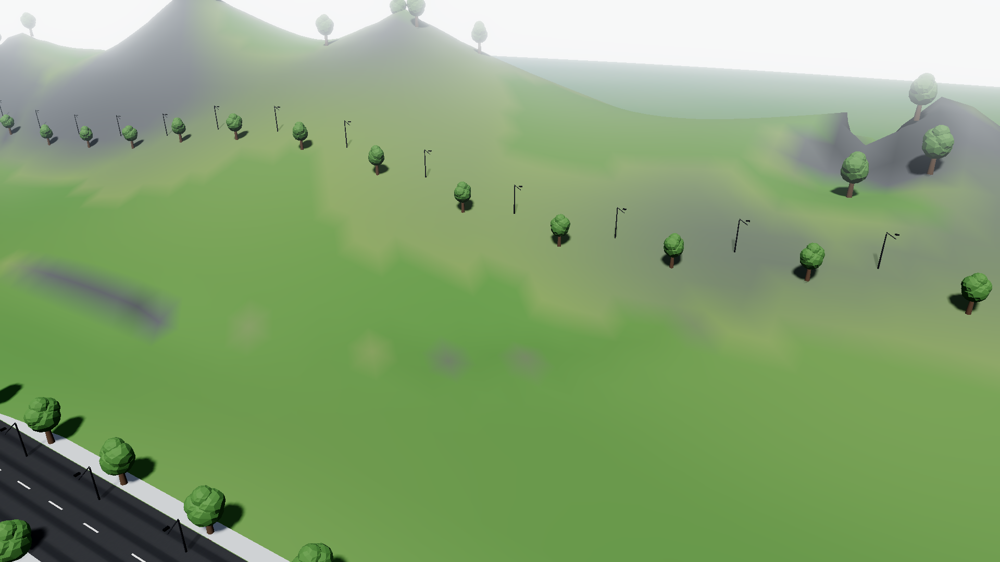
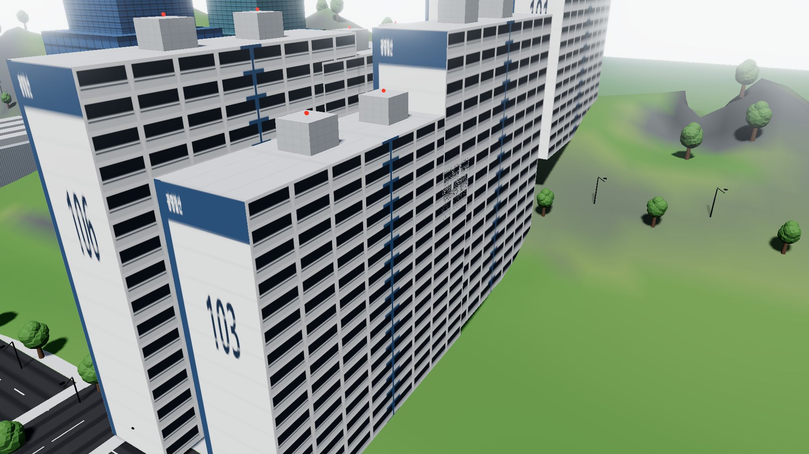
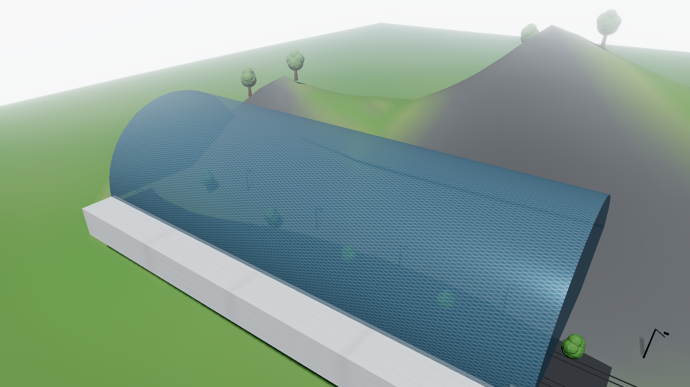
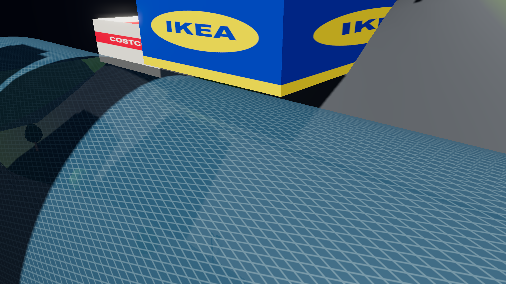

# Skylines Antigravity: Gwangmyeong-si 🏙️

> **AAA Cities: Skylines II–class City Builder in Three.js (r174) + Vite**  
> 1:1 Geographically and Administratively Aligned Digital Twin of **Gwangmyeong City, South Korea (경기도 광명특례시)**  
> Featuring **Dynamic Weather Simulation** & **Historical Time Machine (1970–2026)**.

🔗 **[🎮 Play Live Demo](https://jeiel85.github.io/skylines-antigravity/)**



---

## 🌟 Key Features

### 🌦️ Dynamic Weather Simulation
- **☀️ Clear (맑음)**: Physically calibrated sunlight, sky turbidity, and sharp shadows.
- **🌧️ Rain (비)**: 2,000 instanced camera-tracking falling rain streaks with wind slant, stormy overcast atmosphere, and atmospheric mist.
- **❄️ Snow (눈)**: 1,800 drifting snowflakes with sinusoidal sway and winter lighting.
- **🌫️ Fog (안개)**: Volumetric mist rolling over the Anyangcheon river valley and mountain passes.
- Instant toggling via HUD pills or query parameter (`?weather=rain|snow|fog|clear`).

### ⏳ Historical Time Machine (1970 ~ 2026)
- **Year Slider & Time-Lapse Player**: Drag between 1970 and 2026 or click `▶ 시간여행 재생` to watch the city grow dynamically before your eyes!
- **Landmark Completion Dates**: Landmarks only appear on the map once their real-world construction year is reached:
  - **1970**: Pristine natural mountains & Anyangcheon / Mokgamcheon waterways.
  - **1973**: 기아 오토랜드 소하리 공장 & 광명교
  - **1977**: 철산교 (안양천 횡단 서울 구로 연결)
  - **1980**: 시흥대교
  - **1985**: 철산주공 아파트 대단지 (101~106동)
  - **1989**: 하안주공 아파트 대단지 (201~302동) & 금천교
  - **1990**: 기아대교
  - **2004**: KTX 광명역사 메가터미널 (경부고속철도 개통)
  - **2012**: 코스트코 광명점
  - **2014**: 이케아(IKEA) 한국 1호 광명점
  - **2015**: 가학산 광명동굴 테마파크
  - **2021**: 유플래닛(U-Planet) 40층 초고층 복합타워
  - **2022**: 도덕산 Y자형 출렁다리

---

## 📸 Visual Showcase

| Rain Weather over K-Apartments | Drifting Snow on Dodeoksan Bridge |
| :---: | :---: |
|  |  |

| Time Machine 1970 (Rural Nature) | Time Machine 1985 (Apartments Emerge) |
| :---: | :---: |
|  |  |

| Time Machine 2004 (KTX Station Opened) | Complete 2026 (IKEA, Costco, Towers) |
| :---: | :---: |
|  |  |

---

## 📊 Performance & Budget Compliance

Verified via automated headless Chrome testing on 1080p target:

| Metric | Target Budget | Measured Performance | Status |
| :--- | :--- | :--- | :--- |
| **Demo City Framerate** | $\ge 50$ FPS | **$71\text{--}105$ FPS** | ✅ **PASS** |
| **Isolated Showcase FPS** | $\ge 50$ FPS | **$134\text{--}145$ FPS** | ✅ **PASS** |
| **Console Errors** | $0$ | **$0$** (21 / 21 tests) | ✅ **PASS** |
| **Asset Policy** | 100% CC0 / Procedural | Procedural Canvas PBR | ✅ **PASS** |
| **Determinism** | Bit-exact seeded PRNG | Mulberry32 | ✅ **PASS** |

---

## 🚀 Getting Started

### Local Run
```bash
git clone https://github.com/jeiel85/skylines-antigravity.git
cd skylines-antigravity
npm install
npm run dev
```
Open `http://localhost:5173/` in your browser.

### URL Query Parameters
- Weather: `?weather=rain`, `?weather=snow`, `?weather=fog`, `?weather=clear`
- Historical Year: `?year=1970`, `?year=1985`, `?year=2004`, `?year=2026`
- Time of Day: `?tod=14` (0–24h)
- Camera Presets: `?cam=cheolsan_apartments`, `?cam=ikea_costco`, `?cam=gwangmyeong_cave`, `?cam=ktx_station`, `?cam=dodeoksan_bridge`, `?cam=anyangcheon_bridge`, `?cam=downtown_night`

---

## 📄 License
MIT License. All procedural textures and assets are generated procedurally under CC0 / Public Domain terms.
