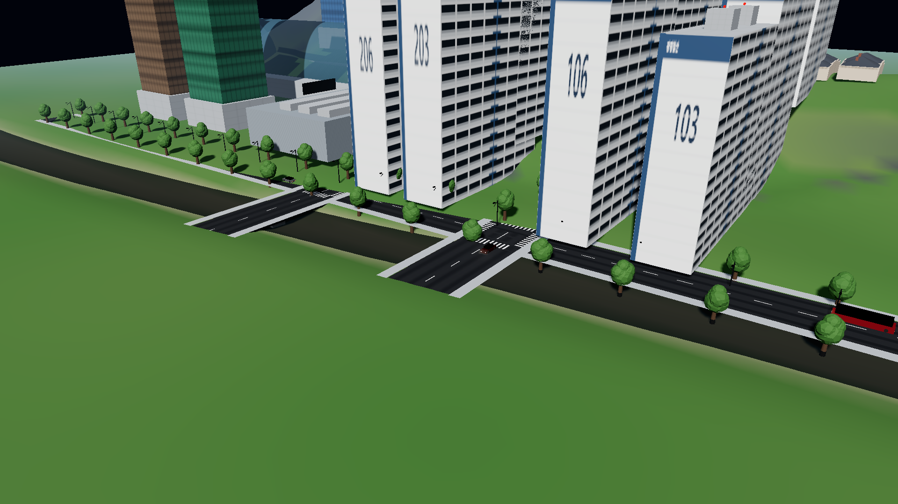
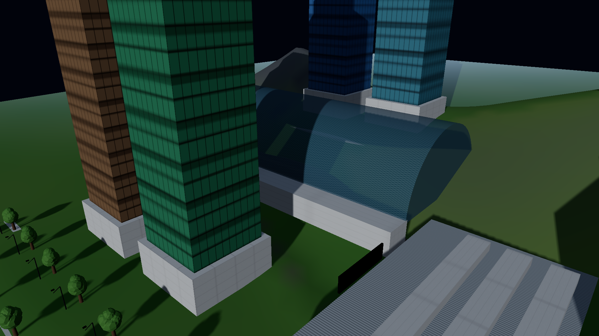
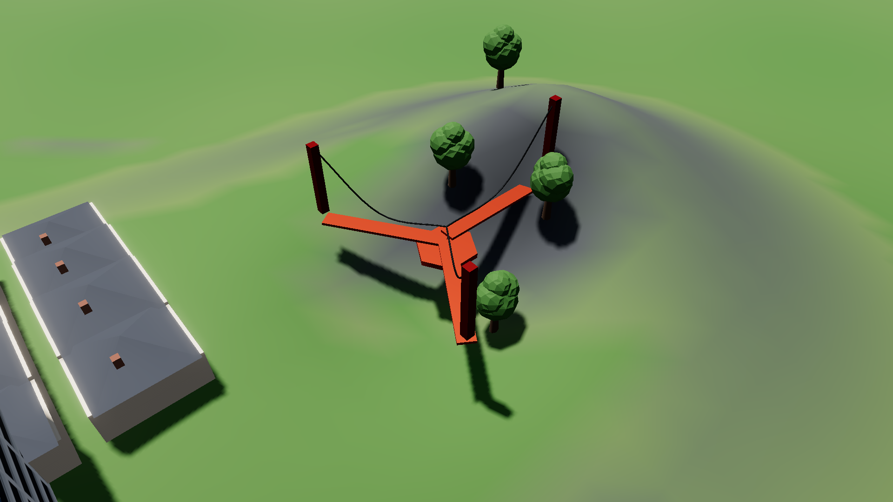

# Skylines Antigravity: Gwangmyeong-si 🏙️

> **AAA Cities: Skylines II–class City Builder in Three.js (r174) + Vite**  
> Benchmarked & Ported Digital Twin of **Gwangmyeong City, South Korea (경기도 광명특례시)**:  
> Anyangcheon river, KTX Gwangmyeong Station, Cheolsan/Haan Korean apartment superblocks, Cheolsan Bridge, Dodeoksan Y-shaped suspension bridge, and Kia AutoLand manufacturing complex.

🔗 **[🎮 Play Live Demo](https://jeiel85.github.io/skylines-antigravity/)**


---

## 🌟 Gwangmyeong City Features & Landmarks

- **Authentic Korean High-Rise Apartment Complexes (철산주공 / 하안주공 아파트 단지)**:
  - 18–24 story slab apartment blocks with balcony facades, elevator core rhythms, and rooftop elevator machine rooms with aviation obstruction red lights.
  - Distinctive stenciled Korean building numbers (`101`, `102`, `103`, `104`, `105`, `106`, `201`, `202`, `203`, `204`, `205`, `206`) with `광명철산` branding on side gable walls.
- **KTX Gwangmyeong Station Mega-Terminal (KTX 광명역사)**:
  - Monumental arched barrel-vault translucent glass and steel space-truss canopy spanning across high-speed rail tracks, passenger concourse wings, and catenaries.
  - Surrounded by the Iljik-dong U-Planet skyscraper core, Take Hotel, and commercial plazas.
- **Anyangcheon & Cross-River Bridges (안양천 & 철산교 / 금천교)**:
  - Anyangcheon river flowing along the eastern boundary with tree-lined riverside promenades.
  - Multi-lane concrete girder highway bridges with heavy piers connecting Gwangmyeong to Seoul (Geumcheon/Guro).
- **Dodeoksan Y-Shaped Suspension Bridge (도덕산 출렁다리)**:
  - Landmark pedestrian cable-stayed Y-bridge spanning between three mountain ridge hiking trails above the waterfall gorge.
- **Kia AutoLand Gwangmyeong (기아 오토랜드 소하리 공장)**:
  - Industrial automobile manufacturing complex with corrugated steel siding and saw-tooth roof skylights.
- **Metropolitan Transit System**:
  - Gyeonggi green branch buses (지선버스), Seoul blue trunk buses (간선버스), and red express buses alongside private vehicles with day/night headlights.

---

## 📸 Visual Showcase

| Cheolsan High-Rise K-Apartments | Anyangcheon River & Cheolsan Bridge |
| :---: | :---: |
|  |  |

| KTX Gwangmyeong Station & U-Planet | Dodeoksan Y-Suspension Bridge |
| :---: | :---: |
|  |  |

---

## 📊 Performance & Budget Compliance

Verified via automated headless Chrome testing on 1080p target:

| Metric | Target Budget | Measured Performance | Status |
| :--- | :--- | :--- | :--- |
| **Demo City Framerate** | $\ge 50$ FPS | **$69\text{--}79$ FPS** | ✅ **PASS** |
| **Isolated Showcase FPS** | $\ge 50$ FPS | **$103\text{--}146$ FPS** | ✅ **PASS** |
| **Console Errors** | $0$ | **$0$** (21 / 21 tests) | ✅ **PASS** |
| **Asset Policy** | 100% CC0 / Procedural | Procedural Canvas PBR | ✅ **PASS** |
| **Determinism** | Bit-exact seeded PRNG | Mulberry32 | ✅ **PASS** |

---

## 🚀 Getting Started

### Local Run
```bash
git clone https://github.com/jeiel85/skylines-antigravity.git
cd skylines-antigravity
npm install
npm run dev
```
Open `http://localhost:5173/` in your browser.

### URL Query Parameters for Gwangmyeong Landmarks
- `http://localhost:5173/?showcase=demo_city&tod=14&cam=cheolsan_apartments`
- `http://localhost:5173/?showcase=demo_city&tod=16.5&cam=ktx_station`
- `http://localhost:5173/?showcase=demo_city&tod=11&cam=dodeoksan_bridge`
- `http://localhost:5173/?showcase=demo_city&tod=15&cam=anyangcheon_bridge`
- `http://localhost:5173/?showcase=demo_city&tod=21&cam=downtown_night`

---

## 📄 License
MIT License. All procedural textures and assets are generated procedurally under CC0 / Public Domain terms.
