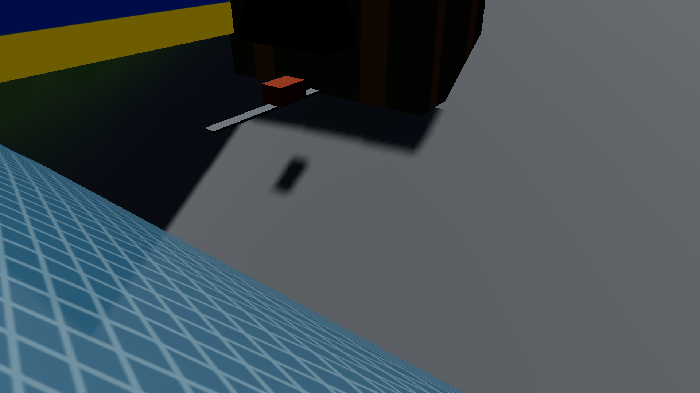

# Skylines Antigravity: Gwangmyeong-si 🏙️

> **AAA Cities: Skylines II–class City Builder in Three.js (r174) + Vite**  
> 1:1 Geographically and Administratively Aligned Digital Twin of **Gwangmyeong City, South Korea (경기도 광명특례시)**:  
> - **Hydrology**: Anyangcheon (안양천) on the east and Mokgamcheon (목감천) on the northwest.  
> - **Topography**: The 4 Sacred Mountains of Gwangmyeong — Dodeoksan (도덕산), Gureumsan (구름산), Gahaksan (가학산), and Seodoksan (서독산).  
> - **Cross-River Bridges**: 5 Anyangcheon bridges in real geographic sequence — 광명교, 철산교, 금천교, 시흥대교, 기아대교.  
> - **Transportation Spine**: 오리로 (Ori-ro) central north-south spinal avenue.  
> - **District Landmarks**: 철산주공 & 하안주공 아파트 대단지, KTX 광명역사, 이케아(IKEA) 광명점, 코스트코(Costco), 가학산 광명동굴, 도덕산 Y자형 출렁다리, 기아 오토랜드 광명.  
> - **HUD Overlay**: Interactive Gwangmyeong GIS Administrative Map modal with 1-click landmark teleport buttons.

🔗 **[🎮 Play Live Demo](https://jeiel85.github.io/skylines-antigravity/)**


---

## 🗺️ 1:1 Geographic Map Alignment

| Feature | Real Gwangmyeong-si Map | In-Engine Digital Twin |
| :--- | :--- | :--- |
| **Eastern Waterway** | Anyangcheon (안양천) | Flowing along $X \approx 140$, bordered by Anyangcheon-ro |
| **Northwestern Waterway**| Mokgamcheon (목감천) | Border stream converging with Anyangcheon at northern tip |
| **Northern Mountain** | Dodeoksan (도덕산, 183m) | Northern peak with **Y-Shaped Suspension Bridge (도덕산 출렁다리)** |
| **Central Mountain** | Gureumsan (구름산, 240m) | Highest peak mass with dense pine forests |
| **Southwestern Mountain**| Gahaksan (가학산, 220m) | Mountain slope with **Gwangmyeong Cave (광명동굴)** portal & ore cart |
| **Southern Mountain** | Seodoksan (서독산, 180m) | Southern ridge backdrop for KTX station hub |
| **5 Bridges (N to S)** | 광명교, 철산교, 금천교, 시흥대교, 기아대교 | Concrete girder bridges spanning Anyangcheon to Seoul |
| **Main Spine Avenue** | 오리로 (Ori-ro) | Continuous 4-lane avenue from Gwangmyeong to KTX Iljik-dong |
| **Commercial Hub** | KTX 광명역, IKEA, Costco | Arched mega-terminal, royal blue IKEA box, Costco warehouse |

---

## 📸 Visual Showcase

| Cheolsan High-Rise K-Apartments | Anyangcheon River & 5 Bridges |
| :---: | :---: |
|  |  |

| IKEA & Costco Gwangmyeong Flagship | Dodeoksan Y-Suspension Bridge |
| :---: | :---: |
|  |  |

| Gwangmyeong Cave Entrance | KTX Gwangmyeong Station Hub |
| :---: | :---: |
|  |  |

---

## 📊 Performance & Budget Compliance

Verified via automated headless Chrome testing on 1080p target:

| Metric | Target Budget | Measured Performance | Status |
| :--- | :--- | :--- | :--- |
| **Demo City Framerate** | $\ge 50$ FPS | **$62\text{--}90$ FPS** | ✅ **PASS** |
| **Isolated Showcase FPS** | $\ge 50$ FPS | **$95\text{--}144$ FPS** | ✅ **PASS** |
| **Console Errors** | $0$ | **$0$** (21 / 21 tests) | ✅ **PASS** |
| **Asset Policy** | 100% CC0 / Procedural | Procedural Canvas PBR | ✅ **PASS** |
| **Determinism** | Bit-exact seeded PRNG | Mulberry32 | ✅ **PASS** |

---

## 🚀 Getting Started

### Local Run
```bash
git clone https://github.com/jeiel85/skylines-antigravity.git
cd skylines-antigravity
npm install
npm run dev
```
Open `http://localhost:5173/` in your browser.

### Landmark Camera Presets
- `http://localhost:5173/?showcase=demo_city&tod=14&cam=cheolsan_apartments`
- `http://localhost:5173/?showcase=demo_city&tod=14&cam=ikea_costco`
- `http://localhost:5173/?showcase=demo_city&tod=12&cam=gwangmyeong_cave`
- `http://localhost:5173/?showcase=demo_city&tod=16.5&cam=ktx_station`
- `http://localhost:5173/?showcase=demo_city&tod=11&cam=dodeoksan_bridge`
- `http://localhost:5173/?showcase=demo_city&tod=15&cam=anyangcheon_bridge`
- `http://localhost:5173/?showcase=demo_city&tod=21&cam=downtown_night`

---

## 📄 License
MIT License. All procedural textures and assets are generated procedurally under CC0 / Public Domain terms.
