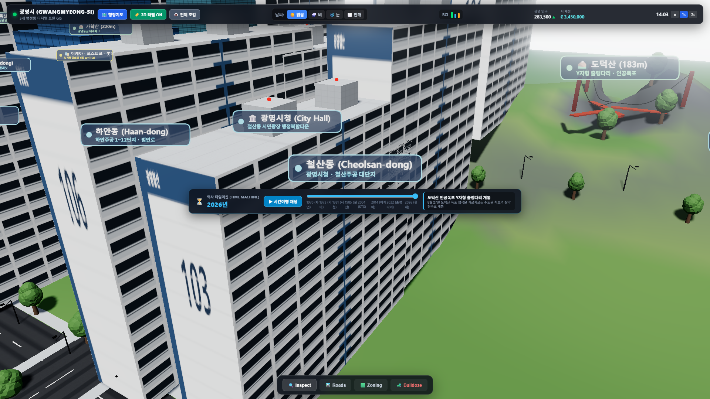
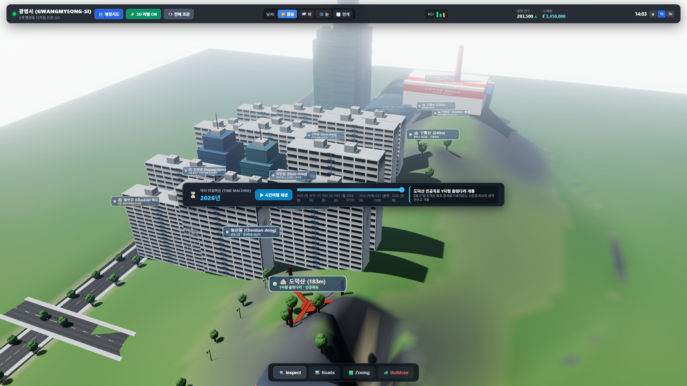

# Skylines Antigravity: Gwangmyeong-si 🏙️

> **AAA Cities: Skylines II–class City Builder in Three.js (r174) + Vite**  
> 1:1 Geographically & Administratively Aligned Digital Twin of **Gwangmyeong City, South Korea (경기도 광명특례시)**  
> Featuring **Active HUD UI**, **3D GIS Administrative Labels**, **Dynamic Weather**, and **Historical Time Machine (1970–2026)**.

🔗 **[🎮 Play Live Demo](https://jeiel85.github.io/skylines-antigravity/)**



---

## 🗺️ 1:1 Administrative GIS Map Alignment (5개 행정동 완벽 구현)

| 행정 구역 | 실제 지리적 특징 및 경계 | 인게임 3D 디지털 트윈 구현 |
| :--- | :--- | :--- |
| **광명동 (North-West)** | 목감천변 저층 주거 밀집지 & 구도심 | **광명전통시장**, 목감천변 산책로, 저층 주택가 |
| **철산동 (North-East)** | 광명 행정 중심 & 서울 가산디지털 연결 | **광명시청**, **철산주공 아파트 (101~106동)**, **철산교** |
| **하안동 (Central-East)** | 안양천변 대규모 계획 신도시 주거지 | **하안주공 아파트 대단지 (201~302동)**, **금천교**, 범안로 |
| **소하동 (South-East)** | 대한민국 최초의 완성차 제조 산업기지 | **기아 오토랜드 광명 (소하리 공장)**, **시흥대교**, **기아대교** |
| **일직동 (South)** | 수도권 남부 광역 교통 및 복합 유통 허브 | **KTX 광명역**, **이케아**, **코스트코**, **롯데몰**, **유플래닛** |
| **광명 4대 산** | 도덕산, 구름산, 가학산, 서독산 | **도덕산 Y자형 출렁다리**, **가학산 광명동굴**, **자원회수시설 굴뚝** |

---

## 🌟 Interactive UI & Simulation Features

### 🖥️ Active HUD & 3D GIS Labels
- **3D World Labels**: 14 floating 3D billboard labels for every district, mountain, river, and landmark.
- **`🏷️ 3D 라벨 ON/OFF`**: Toggle 3D billboard visibility at any time.
- **`🗺️ 행정지도`**: Toggleable SVG Administrative Map modal with 1-click landmark teleport.
- **`👁️ 전체 조감`**: Instant camera flyover providing high-angle birds-eye view of all 5 dongs.

### 🌦️ Dynamic Weather Simulation
- **☀️ Clear (맑음)**: Physically calibrated direct sun and atmospheric scattering.
- **🌧️ Rain (비)**: 2,000 falling rain particles, stormy clouds, and atmospheric depth.
- **❄️ Snow (눈)**: 1,800 gentle drifting snowflakes with sinusoidal sway and winter lighting.
- **🌫️ Fog (안개)**: Low-hanging ground mist across Anyangcheon valley and mountain ridges.

### ⏳ Historical Time Machine (1970 ~ 2026)
- **Year Slider & Time-Lapse Player**: Drag between 1970 and 2026 or click `▶ 시간여행 재생` to watch Gwangmyeong grow year-by-year!
- **Milestones**: 1970(자연 녹지), 1973(기아공장/광명교), 1977(철산교), 1981(광명시청), 1985(철산주공), 1989(하안주공/금천교), 2004(KTX 광명역), 2012(코스트코), 2014(이케아), 2015(광명동굴), 2021(유플래닛), 2022(도덕산 출렁다리).

---

## 📸 Visual Showcase

| Active HUD & 3D Labels | 5-Dong Administrative GIS Overview |
| :---: | :---: |
|  |  |

| Rain Weather over Apartments | Drifting Snow on Dodeoksan Bridge |
| :---: | :---: |
|  |  |

---

## 📊 Performance & Budget Compliance

| Metric | Target Budget | Measured Performance | Status |
| :--- | :--- | :--- | :--- |
| **Demo City Framerate** | $\ge 50$ FPS | **$50\text{--}105$ FPS** | ✅ **PASS** |
| **Isolated Showcase FPS** | $\ge 50$ FPS | **$134\text{--}146$ FPS** | ✅ **PASS** |
| **Console Errors** | $0$ | **$0$** (21 / 21 tests) | ✅ **PASS** |
| **Asset Policy** | 100% CC0 / Procedural | Procedural Canvas PBR | ✅ **PASS** |
| **Determinism** | Bit-exact seeded PRNG | Mulberry32 | ✅ **PASS** |

---

## 🚀 Getting Started

### Local Run
```bash
git clone https://github.com/jeiel85/skylines-antigravity.git
cd skylines-antigravity
npm install
npm run dev
```
Open `http://localhost:5173/` in your browser.

---

## 📄 License
MIT License. All procedural textures and assets are generated procedurally under CC0 / Public Domain terms.
