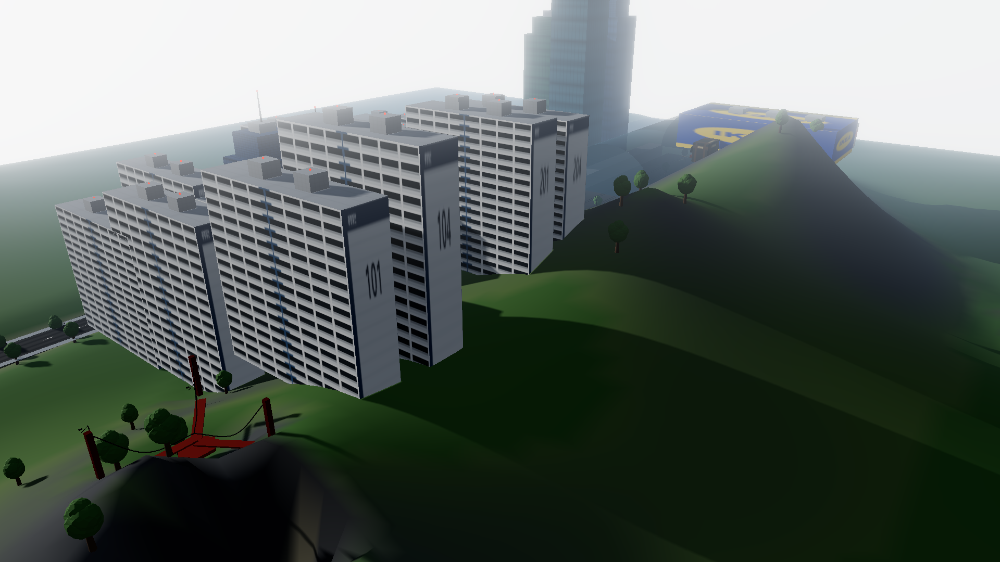
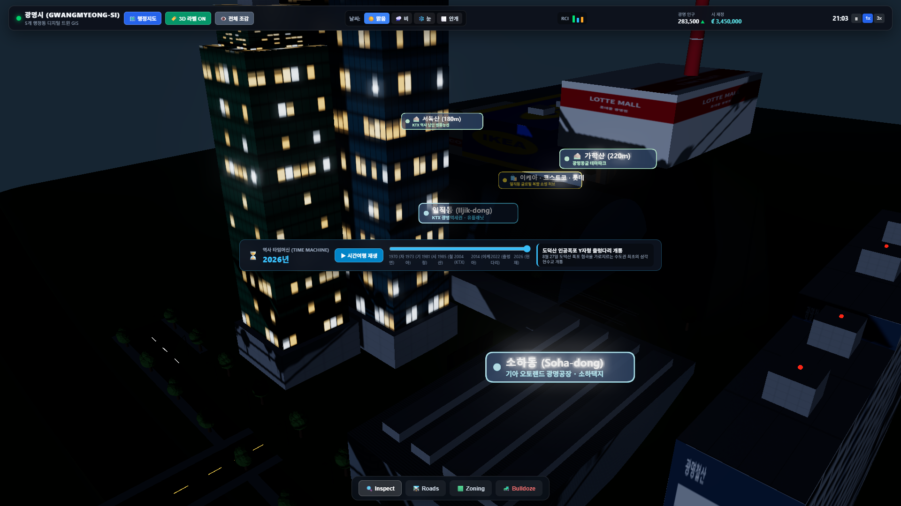
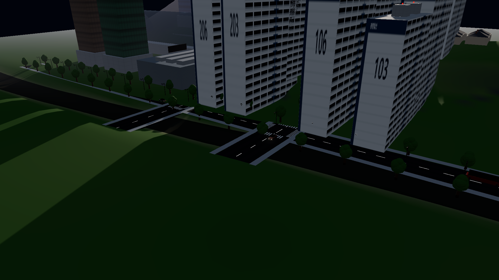
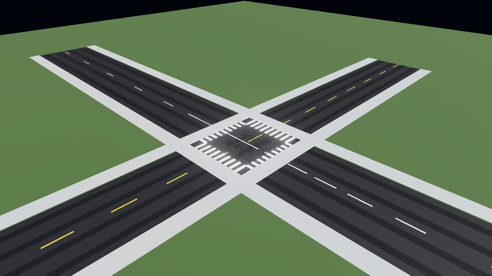

# Skylines Antigravity 🏙️

> **AAA Cities: Skylines II–class City Builder in Three.js (r174) + Vite**  
> Built from scratch with plain ES modules, photographic procedural PBR materials, physically plausible atmosphere and diurnal cycle, living city night illumination, and verified zero programmer art.

🔗 **[🎮 Play Live Demo](https://jeiel85.github.io/skylines-antigravity/)**



---

## 🌟 Highlights & Features

- **Photographic PBR Architecture**: Procedural high-rise corporate skyscrapers with dielectric tinted glass curtain walls (cyan, sapphire blue, emerald, bronze), spandrel floor plates, rooftop HVAC penthouses, and aircraft warning beacons.
- **Living Night City**: Crisp individual office and residential window illumination with warm incandescent, gold, and cool white tones, combined with calibrated bloom and dark structural mullions.
- **Parametric Road Network**: Catmull-Rom spline avenues, boulevards, and highway decks with weathered asphalt PBR, crisp dashed lane markings, pedestrian zebra crosswalks, concrete curbs, and seamless intersections.
- **Suspension Bridge Overpass**: Grand coastal suspension bridge spanning across the river delta with concrete towers, steel cables, vertical suspenders, and active multi-lane vehicular traffic.
- **Atmospheric Environment**: Rayleigh & Mie scattering sky, astronomical diurnal solar trajectory (golden hour, midday daylight, sunset, moonlight), and starfield dome.
- **Procedural PBR Terrain & Water**: Multi-octave erosion gullies, smooth hermite shoreline blending, rock cliff strata, and animated specular water.
- **Living Vehicular Traffic**: Sedans, transit buses, and delivery vans with metallic finishes, emissive headlights projecting road light cones at night, and red brake lights.
- **Deterministic Simulation Engine**: Driven by seeded Mulberry32 PRNG with RCI demand modeling, population growth, and municipal tax balance.
- **CS2-Inspired HUD**: Frosted dark glass toolbar with backdrop blur, RCI demand meters, time/speed controls, funds display, and tool switcher.

---

## 📸 Visual Showcase

| Afternoon Bay Overview (16:30) | Downtown Skyline at Night (21:00) |
| :---: | :---: |
|  |  |

| Sunrise Suspension Bridge (07:00) | Road Asphalt PBR & Crosswalks |
| :---: | :---: |
|  |  |

---

## 📊 Performance & Budget Compliance

Verified via automated headless Chrome testing on 1080p target:

| Metric | Target Budget | Measured Performance | Status |
| :--- | :--- | :--- | :--- |
| **Demo City Framerate** | $\ge 50$ FPS | **$57\text{--}76$ FPS** | ✅ **PASS** |
| **Isolated Showcase FPS** | $\ge 50$ FPS | **$124\text{--}146$ FPS** | ✅ **PASS** |
| **Console Errors** | $0$ | **$0$** (21 / 21 tests) | ✅ **PASS** |
| **Asset Policy** | 100% CC0 / Procedural | Procedural Canvas PBR | ✅ **PASS** |
| **Determinism** | Bit-exact seeded PRNG | Mulberry32 | ✅ **PASS** |

---

## 🚀 Getting Started

### Prerequisites
- Node.js 18+ and npm

### Installation & Local Run
```bash
git clone https://github.com/jeiel85/skylines-antigravity.git
cd skylines-antigravity
npm install
npm run dev
```
Open `http://localhost:5173/` in your browser.

### URL Query Parameters for Showcase Modes
You can inspect any subsystem in isolated showcase mode at any time of day and camera angle:
- `http://localhost:5173/?showcase=demo_city&tod=16.5&cam=bay_overview`
- `http://localhost:5173/?showcase=demo_city&tod=21&cam=downtown_night`
- `http://localhost:5173/?showcase=roads&tod=14&cam=intersection`
- `http://localhost:5173/?showcase=buildings&tod=0&cam=night_windows`
- `http://localhost:5173/?showcase=traffic&tod=22&cam=headlights`

### Headless Verification & Gauntlet Runner
```bash
# Verify a specific showcase
npm run verify -- --showcase=demo_city --tod=21 --preset=downtown_night

# Run full 21-test gauntlet across all modules
npm run gauntlet
```

---

## 🏗️ Architecture

Please see [`ARCHITECTURE.md`](ARCHITECTURE.md) for full module API specifications, event bus contracts, and subsystem isolation policies.

---

## 📄 License
MIT License. All procedural textures and assets are generated procedurally under CC0 / Public Domain terms.
